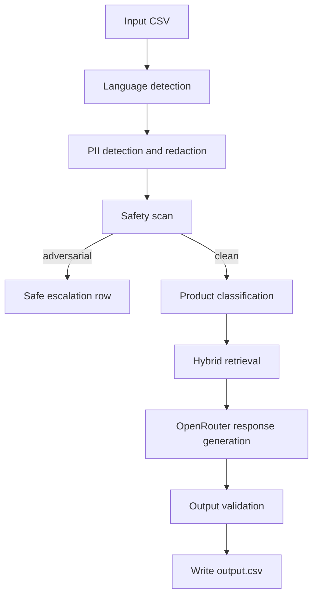

# Architecture

## Overview

The agent is a staged support-ticket triage pipeline. It separates safety, retrieval, generation, and validation so each part can fail safely and be tested independently.

### Flow

## Components

### 1. Input and normalization

`code/main.py` reads the ticket CSV, detects language with `langdetect`, and redacts PII before the ticket is sent to the generation step.

### 2. PII handling

`code/pii.py` detects and redacts common sensitive data such as emails, phone numbers, SSNs, passport-like IDs, IPs, and Luhn-valid credit cards. Redaction happens before retrieval and generation so raw secrets are not propagated through the pipeline.

### 3. Safety layer

`code/safety.py` uses a two-layer detector:

- Layer 1: deterministic pattern checks for prompt injection, jailbreak phrasing, fake authorization, output manipulation, data exfiltration, multilingual variants, and encoded payloads.
- Layer 2: semantic similarity against a small set of adversarial templates.

The safety model load is hardened so the pipeline can still run if Hugging Face access is unavailable. In that case, the rest of the system still falls back to a safe escalation path.

### 4. Retrieval

`code/retriever.py` builds a hybrid retriever over the bundled corpus:

- BM25 for lexical recall
- FAISS for vector search
- Cross-encoder reranking when available

The retriever also includes simple contradiction heuristics and product scoping so the agent can prefer the most relevant corpus slice for DevPlatform, Claude, or Visa tickets.

### 5. Generation

`code/agent.py` wraps the OpenRouter client and asks for a structured JSON response. If the model call fails, the agent returns a safe escalation object instead of crashing.

The generation path is intentionally conservative:

- low temperature
- fixed retry behavior
- token budget reduction for practical local runs
- JSON-only output contract

### 6. Validation

`code/validator.py` repairs malformed JSON when possible, strips markdown fences, filters tool hallucinations, and enforces destructive-action verification ordering. If the response still cannot be recovered, it escalates safely.

### 7. Orchestration

`code/main.py` wires the stages together and writes the final CSV with every required output column.

## Retrieval strategy

The chosen retrieval stack is hybrid rather than pure embedding search because the support corpus mixes product documentation, policy text, and troubleshooting steps. BM25 helps with exact terminology, while embeddings and reranking help with paraphrases and broader semantic matches. This gives stronger recall on short ticket phrasing and more precise ranking on long, noisy conversations.

## Escalation logic

The system escalates when any of the following happen:

- The ticket looks adversarial or unsafe.
- The model output cannot be repaired into valid structured output.
- The runtime encounters a retrieval or generation error.
- The ticket is ambiguous enough that a grounded answer would be risky.

Escalation uses a fixed response template so the output remains predictable and valid.

## Safety and adversarial handling

The safety design favors high recall over narrow precision. That is deliberate because the evaluation emphasizes adversarial robustness. The pipeline blocks obvious injection, paraphrases, multilingual attempts, encoded attacks, and fake authority claims before generation.

The adversarial regression suite in `code/test_adversarial.py` covers these classes of inputs and is intended to be rerun after any change to the safety or validation layers.

## Known limitations

- The semantic safety and retrieval models can fall back to weaker behavior if external model downloads are unavailable.
- The OpenRouter generation path depends on the configured API key and account credit.
- Hybrid retrieval is still heuristic, so edge cases in product classification or corpus conflicts may require manual review.
- The system is optimized for deterministic local evaluation, not for open-ended general support automation.

## Self-assessment

Strengths:

- Clear separation of concerns
- Safe fallbacks instead of hard crashes
- Strong output validation
- Adversarial coverage with a dedicated regression suite

Trade-offs:

- More pipeline stages mean more code and more maintenance
- Heuristic routing can miss some ambiguous tickets
- Fallback behavior can lower answer quality when upstream dependencies fail

## Diagram summary

The architecture is intentionally linear: sanitize, screen, retrieve, generate, validate, write. That keeps the system easy to reason about and makes failures visible at the right stage.
